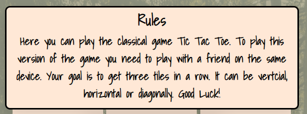
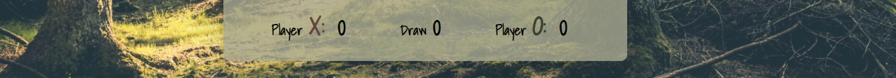

# Tic Tac Toe
## Introduction
This page contains a version of the classic game Tic Tac Toe. The game is played on a three-by-three board and X plays against O and the winner is the one with three in a row. Here two players can play against each other on the same device, perhaps suiting colleagues playing on the coffee break.

## UX/Design
In this section the user experience and design of the site is discussed. Many other games have strong visual effects and colors. This site is designed with the intention to look clean and calming.  For example blinking effects when winnning or draw is displayed in a  beige color. 
### User stories 
- As a user I want to play Tic Tac Toe with a friend on the same device, because it's a fun game.
- As a user I want to quickly understand the sites purpose to see if this is this site have what im looking for.
- As a user I want to quickly understand how the game works to know how to play it.
- As a user I want it to be easy to start playing, so i don't have to waste time. 
- As a user I want it to be easy to see when it's my turn, so i don't have to keep track on my own.
- As a user I want to know the score, so I know who's winning.
### Color-scheme
- The colors chosen for the game is tones of green, beige and brown. These earthy colors combined with the background image of a forest gives the user a peaceful experience while playing.

- Letter X (#60463B), start/restart button and blinking effects (#DDBEA9), background color game board (#C2C5AA) letter O (#6B705C). For letter O on 'Next player' and 'Score' a darker shade of green was used to increase the contrast (#535747). 

### Typography
For typography ‘Shadows into light’ with fallback cursive is used. This style stands out while not stealing focus. 
### Wireframe

## Features
In this section you will find out more about the different features this site contains. All features is located in the ”box”. This design was choosen to give the site a clean design and make the game blend with the background. This also makes it easier for the user to see all the features. 
### Tic Tac Toe header
- The header of the page is centered at the top of the page, this will be the first thing the user sees. Since Tic Tac Toe is a well-known classic game the user will instantly understand the purpose of the site.

### Rules area
- When you first enter the page, the rules of the game is displayed over the game board. This shows the user right away that you need to be two players that plays on the same device. 

### Next player area
- The next player area is a text field showing who’s up next, to make it more clear for the user X and O has different colors. Colors used in next player area is the same as colors used on game board.

### Game board area
- The game board area is a three-by-three grid.

### X and O button
- When a user clicks on a tile the button gets a shadowy effect and the current player (X or O) is presented on the button to show that the button is claimed. X and O has different colors on their claimed tiles, this is to make it clearer who has what.

### Points area 
- In this area the score is presented, we can see how many games won by X or O or games that ended in draw. As before the players have different colors on the scores, the same as on the game board and next player area.

### Start button/Restart button
- The same style and placement are used for restart and start, just different text. Located at the center of the board it is impossible for the user to miss.
- On the mobile device the start button is dispalyed at the lower part of the game board. This is to make space for the game rules.

 

### Winning player animation 
- When a player wins it will be shown by a beige flashing on the winning combination. 

### Draw animation
- When the game is draw it will be shown by a blinking X over the game board. 

## Test and validation
Read more about test and validation [here](/TEST.md)
## Bugs corrections and improvements
### Unfixed bugs
- There are no known bugs.
### Solved bugs 
- Bug when the need for individual styling of start button occured. The same button is used for start and restart game but the placement of the button is different because of the size of the button. Start/Restart needs different styling to be placed in the center of the game board. When added a new id, the restart button was always visible. Solved by adding if-statements that checks if button is null or not depending on the id.

- Bug blinking animation when winning. When the game has finished the blinking animation could change pattern if the user clicked a tile that have not been clicked. Solved by disabeling all buttons when someone has won. 

- Chrome Devtools report the following error: "https://8000-teal-squirrel-aamz0q95.ws-eu25.gitpod.io/favicon.ico 404." . Solved by adding a favicon that is in png format.

- Bug when scores goes from single digit to double digit. The score text of player O was pushed out of the game board when number goes from single digit to double. Solved by changing styling of paragraphs in score area. 

### Future improvements
- In this version of the game only two players on the same device are supported. In the future adding the possibility to play against the computer would give the users more ways to enjoy the game.

- Another improvement would be allowing the users to add names while playing and saving the scores from different sessions. A fun feature allowing users to have long running competitions. 
## Deployment
This section describes how the site was deployed. The project was deployed to GitHub Pages. 

1. Log in  to GitHub and choose the repository.
2. Go to the 'Settings' button. Located just above repository content.
3. Scroll down the page until you can find 'Pages' (or choose 'Pages' in the menu to the left).
4. In section 'Source', click the dropdown menu with value 'None' and select 'main'.
5. Wait until GitHub has created yor link to the deployed site. 
6. Scroll back down through the page to locate the published site link in the section 'Pages'.

## Credits
This section describes code, content and media and tools that were used when building this site. Special thanks to my mentor Reuben Ferrante for great ideas and support.

### Code
[Codeinwp – Event listener](https://www.codeinwp.com/snippets/add-event-listener-to-multiple-elements-with-javascript/): Used as guide when adding event listeners.

[Developer drive – Grid system](https://www.developerdrive.com/how-to-create-a-css-grid-step-by-step ): Used as guide for building grid system for game board.

[Favicon](https://favicon.io/favicon-generator/): Used for creating favicon image.

[Flexible – Disable buttons](https://flexiple.com/disable-button-javascript/): Used as guide for disabling buttons.

[MDN Web Docs – Element.classlist](https://developer.mozilla.org/en-US/docs/Web/API/Element/classList): Used as guide for removing earlier added classes from X and O buttons when restarting the game.

[PY4U.NET - Text-flash](https://www.py4u.net/discuss/301230): Used as guide for making game board buttons blink when someone winns or the game is draw. 

[Stackoverflow – undefined or null](https://stackoverflow.com/questions/2647867/how-can-i-determine-if-a-variable-is-undefined-or-null): Used as guide for checking if null.

[w3school - Clear interval](https://www.w3schools.com/jsref/met_win_clearinterval.asp): Used as guide for removing blinking effects on game board buttons when restarting the game. 

[Youtube – Kevin Powell](https://www.youtube.com/watch?v=Yon4l3MUBGY): Used as guide for making box-shadow on gameboard and buttons. 

### Content and media
[Google fonts](https://fonts.google.com/): Used for all text. 

[Pexels](https://www.pexels.com/): The background image is from Pexels. 
### Tools
[Coolors](https://coolors.co/palettes/trending ): Used for finding colors that go well together. 

[HTML color codes](https://www.hexcolortool.com/): Used to make the green used for player O button darker.

[HexToRGB](https://www.hextorgb.co/ ): For convert hex to rgb this converter were used. 

